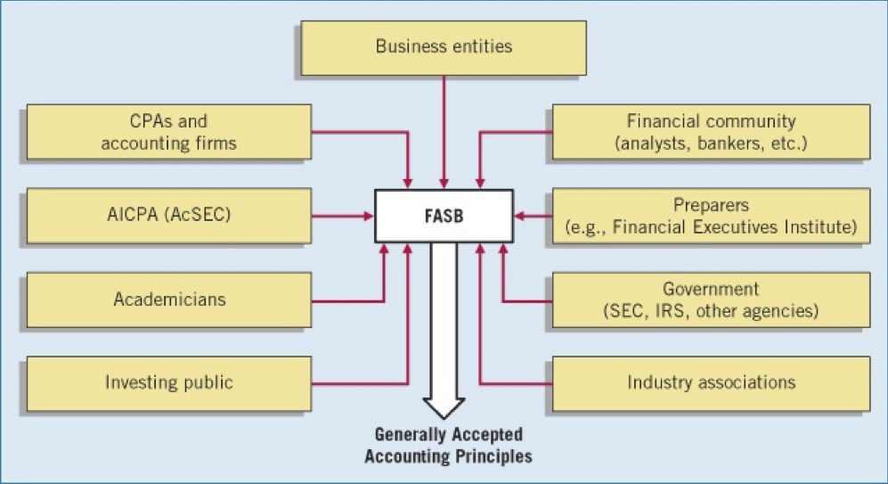

## Generals
---------------------------
- Instructor: John Lord, CPA
- Office Location: Huang 342
- lordj@stanford.edu, 510-455-1029
- Office hours: Monday/Wednesday 8-9:15 am and by appointment
- Class days : Monday/Wednesday 9:30-11:20 am 
- Classroom: Skilling Auditorium
- TextBook: Financial and Managerial Accounting 7th edition (McGraw hill)

## Grading Policy
---------------------------
- Examination: 75% (300 points)
  - mid term1, mid term 2, final (mid term 3)
  - 30 MCQs each mid term
  - Mid term 3 is not comprehensive
- Guest Speaker write up: 20% (80)
  - 3 Page paper (80 points)
  - 6 page paper (10 points extra credit)
- Attendance: 5% (20 points)
- Extra Credit: (10 points)
- 100-..(A+), 93-100(A), 92-92.99 (A-), 87-89.99(B+)


## Business Structures, Forms of Business Ownerships
---------------------------
- Proprietorship
  - single owner, sole proprietor
  - easy to form
  - unlimited liability
- Partnership
  - Owned by two or more partners 
  - unlimited liability 
- Corporation
  - Ownership in stocks
  - Separate legal entity, in compliance with state charter
  - Limited liability


## Users of a finance report of a company
---------------------------
- Internal
  - Marketing
  - Management
  - Finance
  - Human Resources

- External
  - primary users:
    - Creditors: who loan us money with expectation of getting back. 
    - Investors: Give money to company, to grow together.
  - Secondary users:
    - Regulatory Entities: IRS, SEC
    - Financial Consultants: confidant but still external
    - Competitors
    - Customers

## Regulatory Entities
---------------------------
- SEC (Security and Exchange Commission):
  - Federal Agency that holds regulatory power over publically traded companies.
  - Created in 1933/1934 

- GAAP (Generally Accepted Accounting Procedures)
  - Common set of standards and procedures
  - SEC has the legal priority to develop GAAP

- FASB (Financial Accounting Standards Board)
  - started in 1933
  - 7 Member board, so can have simple 4:3 majority for new laws
  - 5 year term for board members
  - SEC develops GAAP by delegating that authority to FASB and watching over. 

- PCAOB (Public Company Accounting Oversight Board)
  - issues the standards for Auditors 
  - also audits auditors time to time
  - stops additional services by auditors (consultation) with auditing

- IFRS (International Financial Reporting Standards)
  - Like GAAP but International
  - To list in NYSE, accounting have to use GAAP (FASB Standards)
  - To list in UAE, accounting should be complied with IFRS
  - Includes a system of Inventory which is not allowed in GAAP. 
    That inventory system costs companies more taxes. 
  - China says they follow IFRS but they have cherry picked what then follow. 

- IASB (International Accounting Standards Board)
  - Decides on IFRS
  - FASB and IASB have a love hate relationship


- GAAP Political Process



## Financial Statements
---------------------------
- Balance Sheet
  - shows a balance of 
    Total of assets = total of our liabilities + Stockholders equity
  - contains 
    ICFR (Internal Control Financial Reporting)

- Income Statement
  - report Net Income ( = Revenue - Expenses)
  - Synonym : Consolidated Statement of Operations
  - presents the revenues and expenses for a specific period of time

- Retained Earnings Statement
  - previous retained earnings + net income - dividends
  - 


- Statement of Stockholders Equity
- Statement of Cash Flows
- Note Disclosure

- 10-K report
  - Filed annually with SEC

- 10-Q report
  - Filed quarterly with SEC


## GAAP:
----------------------------
- Historical Cost Principle (or cost Principle)
  - dictates that companies record assets at it's Historical Cost
  - some items like land, fixed assets, poperty

- Fair Value Principle: 
  - states that assets and liabilities should be reported at fair value (the price
    received to sell an asset or settle a liability). 
  - some items like commodities, stocks, investment securities
  - FASB decides what item goes in historical vs. which one in fair value

- Monetary Unit Assumption:
  - requires that companies include in the accounting records only transaction 
    data that can be expressed in terms of money.
  - Basically all money units should be in same denominators (like only USD for US companies)

- Economic Entity Assumption:
  - requires that activities of the entity be kept separate and distinct from the
    activities of its owner and all other economic entities.
  - a car is personal asset but a truck used for carrying equipments can be a company asset

- Sarbanes-Oxley Act of 2002 (SOX)
  - was a response to accounting scandals in the late 1990’s and early 2000’s
  - Resulted in:
    - The Public Company Accounting Oversight Board (PCAOB), which oversees audit firms
    - Requires stronger independence for auditors
    - Requires CEOs and CFOs to personally certify financial statements and disclosures 
    - Requires audit committees to be made of independent directors
    - Requires attestation to ICFR

- Asset = liabilities + Stockholders equity
  -----
  - anything that has future economic benefit, including cash
  - Liabilities, equity: claims against company's assets

  - Liabilities:
    ------------
    - all the payable's are liabilities

  - Stockholders Equity: common stocks + retained earnings
    -------------------
    - Common Stocks
    - AKA: Owners Equity
    - Retained Earnings = Revenues - Expenses - dividends
      - Revenue: inflow of money for services we provided
      - Expenses: kharche. 
      - dividend: pulling out some money out of earnings (hissa). 
                  even though dividend and expense may look similar but they are very different concepts
      - BASE = Beginning balance, add revenue, subtract expenses and dividends, ending balance 

```
Assets = cash + accounts receivable + supplies + equipments 
       = liabilities (account payables) + stockholder's equity
       = liabilities (account payables) + common stock + retained earnings
       = liabilities (account payables) + common stock + revenue - expenses - dividend
```

## Glossary:
----------------------------
*   Temporary Accounts:
    - Accounts that we turn back to zero at the end of each year
    - Revenue, Expense, Dividend, Income Summary

*   Permanent accounts:
    - The do not turn to 0 at the end of the year, these are balance sheet accounts
    - Accumulated Depreciation—Equipment, Prepaid Insurance, Unearned Revenue, Accounts Receivable. 

*  Fiscal year:
   - a 12 month period, that start at a decided date on calendar year

*  Convergence:
   - FASB and IASB make efforts to reduce differences between GAAP and IFRS through a process called convergence

*  Luca Pacioli:
   - origins of accounting are generally attributed to the work of Luca Pacioli

* Posting 
  - The process of transferring general journal entry information to the ledger

*  Debit on the left, credit on the right

*  Debit Credit Rules:
   - eg: buy machine on credit: asset 
   - if we want to decrease revenue, we will debit it, 
   - if we want to increase an expense, we will debit it. 
   - if we want to decrease an expense, we will credit it.
   - /\ = +; \/ = -
```
           Asset   Liability   Equity    Revenue    Expense
-------------------------------------------------------------
Debit  |    /\         \/        \/         \/        /\
       |                                                       
Credit |    \/         /\        /\         /\        \/
-------------------------------------------------------------        
```

*  Chart of Accounts
   - Assets
     - 101 Cash
     - 112 Accounts Receivable
     - 126 Supplies
     - 130 Prepaid Insurance
     - 157 Equipment
     - 158 Accumulated Depreciation- Equipment

   - Liabilities
     - 200 Notes Payable
     - 201 Accounts Payable
     - 209 Unearned Service Revenue
     - 212 Salaries and wages Payable
     - 230 Interest Payable

   - Stockholder's Equity
     - 311 Common Stock
     - 320 Retained Earnings
     - 332 Dividends
     - 350 Income Summary

   - Revenue
     - 400 Service Revenue

   - Expenses
     - 631 Supplies Expense
     - 711 Depreciation Expense
     - 722 Insurance Expense
     - 726 Salaries and Wages Expense
     - 729 Rent Expense
     - 732 Utilities Expense
     - 905 Interest Expense


* Journal -> Ledger -> Balance Sheet

* Financial Reports in order
1. Income Statement
   Net Income = Revenue - Expenses
2. Statement of Retained Earnings
   Ending Balance = Beginning Balance + Net Income - Dividend
3. Balance Sheet
   Assets = Liabilities + Stock Holders Equity
4. Closing Statement
   
 
## Adjusting

1. Prepaid Expenses
   - An asset, eg. prepaid insurance
   - Expire either with the passage of time or through use
   - Adjusting: 
     - Increase (Debit) to an expense account and 
     - Decrease (credit) to an asset account

2. Unearned Revenue
   - Cash received before services are performed (revenue recorded)
   - Often occur in regards to rent, airline tickets, subscriptions, customer deposits

3. Accrued Revenues:
   - Revenues for services performed but not yet received in cash or recorded
   - often occur in regards to Rent, interest, services performed

4. Accrued Expenses:
   - Expenses incurred but not yet paid in cash or recorded
   - often occur in regards to interest, taxes, salaries


## Merchandising
----------------

* net cost of the inventory = original invoice price - returns - discount + delivery charges 

* Net Sales or Revenues = Original Invoice Price - Returns - Discount
* Gross Profit aka Gross Margin = Net Sales - Cost of goods sold
* Operating Income = Gross Profit - Operating Expenses
* Net Income = Operating Income - Non Operating Expenses
* gross profit ratio aka gross margin ratio = Gross profit / Net sales

* Operating Expenses:
  + Includes following:
    - Salaries and wages expense 
    - Utilities expense
    - Advertising expense 
    - Depreciation expense
    - Freight-out
    - Insurance expense

    - Interest expenses are NOT operating expenses unless it's a bank or financial institute. 

* Non-Operating Items: 
  + Includes: 
    - Interest Revenue
    - Interest Expense
    - Gains/losses on sale of equipments


* 2/10 n/30 (Two ten net thirty):
  + get two percent discount if you pay in 10 days or pay full amount in 30 days

### Perpetual System:
-------------------
- Update 

* Advantages:
  - shows the quantity and cost of the inventory that should be on hand at any time
  - Provides better control over inventories than a periodic system. 


## Depreciation
---------------
* Process of allocating the future economic benefit of long-term asset over their 
  useful (service) life to expense in a rational and systematic manner.

* Cost:
  + all expenditure necessary to acquire the asset and make it ready for intended use 

* Useful Life:
  + Estimate of the expected life based on need for repair, service life, and vulnerability to obsolescence 

* Salvage Vale:
  + Estimate of the asset's value at the end of it's useful life
  + We don't depreciate anymore once we reach salvage value

* Depreciation Method 
  + Types:
    - Straight-Line
      - a truck with value 10K and salvage value 2K after 5 years has a 20% depreciation 8k/5 = 1600 per year
    - Units-of-Activity
      - a truck with value 10K and salvage value 2K after 100K miles has a 8k/100K depreciation per mile driven
    - Declining Balance
      - Each year depreciation = Beginning year book value * declining balance percentage
      - with 40% declining 13000 - 5200 -> 7800 - 3120 -> 4680 - 1872 -> 2808 - 1123 -> 1685 - 685 -> 1000
      - In the final year 40% of 1685 = 674 is adjusted to 685
      - Or we can 1685 - 674 -> 1011 - 11 -> 1000 (since we do not depreciate more than salvage value)
      - we care about salvage value towards the end of the calculations 

* Intangible assets:
  + Types
    - Patents
    - Copyrights
    - Goodwill
    - Trademarks and Trade Names
    - Franchises

## Stocks
----------

### Characteristics of a Organization
Characteristics that distinguish corporations from proprietorships and partnerships.
-   Separate Legal Existence
-   Limited Liability of Stockholders
-   Transferable Ownership Rights
-   Ability to Acquire Capital
-   Continuous Life
-   Government Regulations
-   Additional Taxes
-   Corporate Management


### Stocks

* Types
  + Authorized Stock: the amount of stock that a corporation is authorized to sell. 
  + Issued Stock: the amount of stocks actually issued
  + treasury stock: buy'ed back stocks by a company 
    - To reissue the shares to officers and employees under bonus and stock compensation plans.
    - To enhance the stock’s market value. 
    - To have additional shares available for use in the acquisition of other companies.
    - To increase earnings per share. 

  + outstanding stock: issued stock - treasury stock

  + Preferred Stocks:
    - Typically, preferred stockholders have a priority as to:
      - Distributions of earnings (dividends).
      - Assets in event of liquidation.
    - Generally do not have voting rights.

  + Par value vs. No-Par Value Stocks
    - years ago, the par value determined the legal capital per share that a company must retain 
      in the business for the protection of corporate creditors.
    - Today it's not needed and no-par value stocks are more common.  

* Stock Split
  + Reduces the market value of shares.
  + No entry recorded for a stock split.
  + Decrease par value and increase number of shares.

* Dividend:
  + Paid to the person holding stock on the date of record.
  + issued to all outstanding stocks

* Cumulative Dividend:
  + Preferred stockholders must be paid both current-year dividends and any unpaid prior-year 
    dividends before common stockholders receive dividends.
  + Total Preferred dividends = Dividends in arrears + current-year dividends


## Financial Statement Analysis
---------------------------------
* Characteristics 
  + Liquidity 
  + Profitability 
  + Solvency

* Comparison Bases
  + Intracompany
  + Industry averages
  + Intercompany

* Tools of Analysis
  + Horizontal Analysis 
    - aka Longitudinal Analysis
    - aka Year to Year Analysis
  + Vertical Analysis
    - Within same financial statement
    - Percentage of cost of goods sold = COGS / Net Sales 
    - Percentage of Net income = Net Income / Net Sales 
    - Average Collection period
      - average net receivables = (beginning balance + ending balance )/ 2
      - receivable turnover = net credit sales / average net receivables 
      - Average Collection Period = 365 days / receivable turnover
    - Average Days in inventory
      - average inventory  = (beginning + ending )/ 2
      - inventory turnover = cost of goods sold / average inventory 
      - Average Days in inventory = 365 days / inventory turnover

  + Ratio Analysis
    - Current Ratio = Current Assets / Current Liabilities
    - Inventory Turnover = cost of goods sold / average inventory
    - Debt to Asset Ratio = total debt / total assets


## Cash Flow Statement 
-----------------------

### Usefulness 
Provides information to help assess:
* Entity's ability to generate future cash flows
* Entity's ability to pay dividends and meet obligations 
* Reasons for difference between net income and net cash provided (used) by operating activities
* Cash investing and financing transactions during the period. 

### Classification of cash flows
* Operating Activities:
  Income statement items. 

* Investing Activities
  changes in investments and Long-term asset items

* Financing Activities
  changes in long-term liabilities and stockholders equity items

### CLAD 
* Current Items: 
  + items on balance sheet (eg. account receivable, inventory, prepaid assets, current liability, account payable, etc. )
  + Use Opposite signs for assets 
    - Subtract Account Receivable increases
    - Add Account Receivable decrease
  + Use same sign for liabilities
    - Add Account payable increases
    - Subtract Account payable decrease

* Losses and Gains
  + add losses and subtract gains

* And
* Depreciations
  + Always add back depreciation expenses

### Order of presentation 
* Operating activities (eg. Paying employees salary, collecting cash for services performed)
* Investing activities (eg. purchase of equipments)
* Financing activities (eg. issuing stocks, borrowing money)


## Cost Volume Profit Relationship
-----------------------------------

* Cost Behavior:
  + Variable costs: 
    - varies based on number of units
    - direct labor, direct materials, indirect labor, delivery expense, indirect material

  + Fixed Costs
    - remains fixed irrespective of number of units produced
    - eg. executive salary, depreciation of equipment, television advertising

  + Mixed Costs
    fixed upto a point and increases then based on number of units

### Contribution Margin:

Contribution margin = Sales - variable costs

- CM is first used to cover fixed expenses. Any remaining CM contributes to net operating income.

Unit sales to break even = fixed expenses / CM per unit

* The Contribution Approach
Y = a + b x    where a = fixed cost, b = variable cost, x = units produced

  + variable cost is the slope in the y = mx + c equation. 
  + High Low analysis :
    - change in the cost divided by the change in hours 
    - (y2- y1) / (h2 - h1)

* Contribution Margin Ratio 
  - = total contribution margin / total sales  
  - or = contribution margin per unit / sale cost per unit

* variable expense ratio 
  - simply the complement of contribution margin ratio
  - if CM ratio is 40% VE ratio is 60%
  - = total variable expense / total sales
  - = variable expense per unit / sale cost per unit


### Target Profit 

* Unit sales to attain target profit =  (Target Profit + fixed expenses) / CM per unit

* Dollar sales to attain the target profit = (Target profit + fixed expenses) / CM Ratio

## Capitol Budgeting decision 
-----------------------------
* eg:
  - Plant expansion
  - equipment selection 
  - lease or buy
  - equipment replacement
  - Cost reduction

* Time value of Money 
  + A dollar today is worth more than a dollar a year from now. 


### Method
* The payback method:
  + focuses of payback period. 
    - length of time that it takes for project to recoup its initial cost out of the case receipts that it generates. 

    - Payback period = Investment required / annual net cash inflow

  + Shortcomings:
    - ignores the time value of money 
    - ignores cash flows  after the payback period
    - shorter payback period does not always mean a more desirable investment 

  + advantages:
    - serves as screening tool
    - identifies products that recoup initial investment quickly 
    - identifies investments that recoup cash investments quickly. 

* Net Present Value method:
  + Once you have computed a net present value, interpret
    - a positive net present value indicates that the project's return exceeds the discount rate 
    - a negative net present value indicates that the project's return is less that the discount rate 

  + Total Cost Approach:
    - expansion of Net Present Value Method. 
    - if company has two approach (repair existing equipment vs. buying a new one), company get the total cost 
      of both over the period of time and takes a decision 

* Internal Rate of Return Method: 
  + The internal rate of return is the rate of return promised by an investment project over its useful life. 
    It is computed by finding the discount rate that will cause the net present value of a project to be zero.
  + It works very well if a project’s cash flows are identical every year.
    If the annual cash flows are not identical, a trial-and-error process must be used to find the internal rate of return.

  + present value factor for thee internal rate of return = Investment Required / Annual net cash flow 
  + or
  + PV Factor * annual cashflow = initial investment

  + Simple Rate of Return Method
    - Does not focus on cash flows -- rather it focuses on accounting net operating income.
    - Simple rate of return = Annual incremental net operating income / Initial investment
